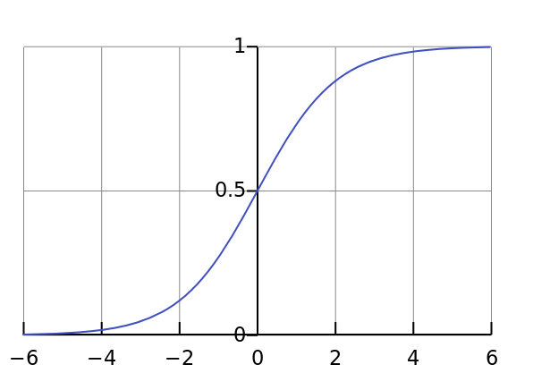

1.逻辑回归用来解决二分类问题。

与感知机设置阈值来预测分类的方式不同，逻辑回归使用输出一个概率值来预测分类结果。

将线性回归的结果代入一函数，来获取概率，函数为sigmoid函数。
$$
sigmoid(x) = \frac{1}{1+e^{-x}} 
$$
函数图像：

损失函数推导过程：

样本的标签值：
$$
y \in(0, 1)
$$
假设样本i发生的概率为：P，那么当样本实际值为yi=0时即样本i不发生的概率就是1-P。表达式：
$$
P(y|x)=\begin{cases}P,&y=1 \\ 1-P,&y=0 \end{cases}
$$
整理为一个表达式：
$$
P(y|x) = P^y(1-P)^{1-y}
$$
那么当m个样本时，发生的概率为：
$$
P(Y|X) = \prod^m_{i=1}P^{yi}(1-P)^{1-yi} 
\\ 其中P = \frac{1}{1+e^{-xi}}
$$
根据极大似然估计，最大化这个概率值。连乘不好计算，这里求**对数**，因为求对数不改变单调性，改为对数后再让这个对数值最大化，相当于求负对数值的最小值：
$$
logP(Y|X) = \sum^m_{i=1}(y_ilogP+ (1-y_i)log(1-P))
$$

$$
-logP(Y|X) = \sum^m_{i=1}(-y_ilogP - (1-y_i)log(1-P))
$$

softmax回归用来解决多分类问题。是逻辑回归的一般形式。

